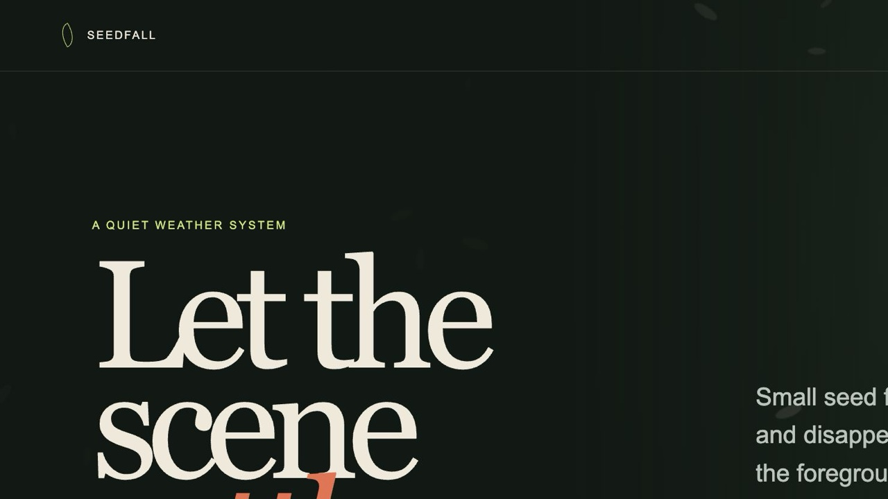
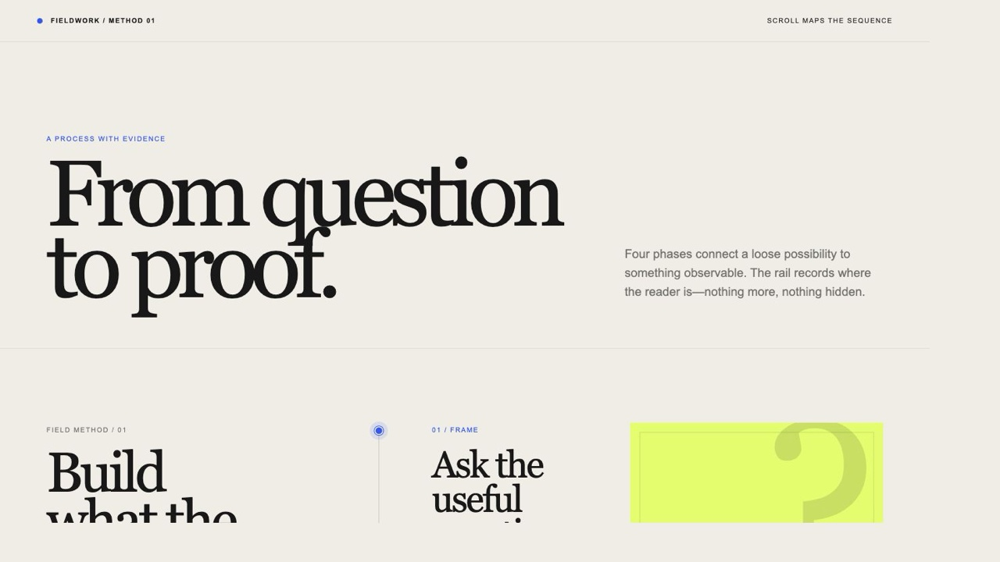
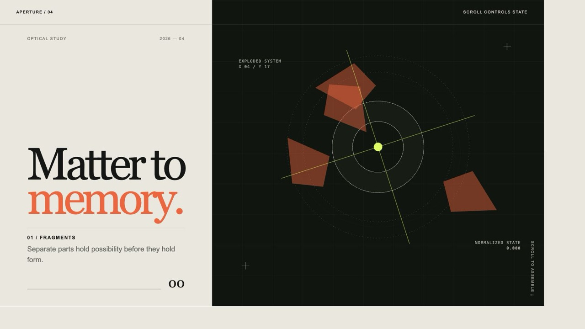
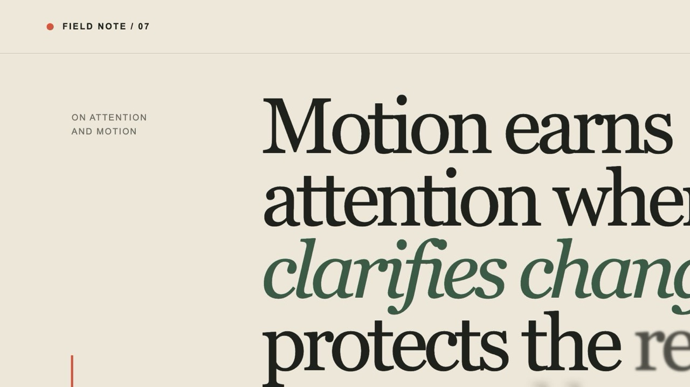

# Demo Screenshot Gallery

Every tracked skill is shown as a real browser rendering of its local `demo/index.html`.

- Captured demos: 88
- Browser viewport: 1280 x 720 (a few source pages export a slightly scaled JPEG)
- Format: JPEG
- Reveal hover effect: includes both default and interaction states

Open the [visual browser gallery](SCREENSHOTS.html), or see [DEMOS.md](DEMOS.md) for the complete demo, prompt, and source index.

## codex (12)

### audit-verify-explain-grade-5

Audit work, verify claims with concrete evidence, and explain the result in simple grade-5 language. Use when the user asks to review, audit, check, verify, explain a change, explain a fix, summarize test results, validate whether something works, or translate technical findings into plain language for non-technical readers.

[Open demo](agent-skills/codex/audit-verify-explain-grade-5/demo/index.html) · [Skill](agent-skills/codex/audit-verify-explain-grade-5/SKILL.md) · [Prompt](agent-skills/codex/audit-verify-explain-grade-5/demo/PROMPT.md) · Local demo

### browser-video-recording

Create polished 60 fps 4:3 4K browser screen-recording style videos from Codex in-app browser captures, with browser-only crop, natural macOS cursor styling, deliberate click choreography, zoom-follow framing, ffprobe/thumbnail verification, and optional native recording compatibility checks. Use when the user asks to record or re-record browser actions, show cursor clicks and zooms, make Dribbble/UI inspiration or product demo recordings, or asks whether Codex, Playwright, or an MCP can produce a natural browser demo video.

[Open demo](agent-skills/codex/browser-video-recording/demo/index.html) · [Skill](agent-skills/codex/browser-video-recording/SKILL.md) · [Prompt](agent-skills/codex/browser-video-recording/demo/PROMPT.md) · Local demo

### customer-email-draft-threads

Draft-only Gmail customer support triage with per-draft Codex project threads. Use when the user asks to run the customer email automation, check unread/recent support emails, prepare Gmail draft replies, triage customer/person emails while skipping automated mail, or create agent/project threads for drafted email follow-up.

[Open demo](agent-skills/codex/customer-email-draft-threads/demo/index.html) · [Skill](agent-skills/codex/customer-email-draft-threads/SKILL.md) · [Prompt](agent-skills/codex/customer-email-draft-threads/demo/PROMPT.md) · Local demo

### customer-support-verification

Verify customer support work against the applicable runbook, draft-safety, evidence, mutation, and commit-scope requirements. Use after every Gmail/customer support triage, billing/cancellation/refund/account/access investigation, support handoff, or draft-review task before the final response; also use when the user asks to verify support work against a runbook, checklist, skill, or requirements.

[Open demo](agent-skills/codex/customer-support-verification/demo/index.html) · [Skill](agent-skills/codex/customer-support-verification/SKILL.md) · [Prompt](agent-skills/codex/customer-support-verification/demo/PROMPT.md) · Local demo

### daily-ui-inspiration-capture

Create a recurring daily UI inspiration capture. Use when the user asks to run, refresh, package, or validate dated UI inspiration bundles, especially for `articles/YYYY-MM-DD-ui-inspiration-capture/` outputs, Framer/Dribbble landing-page inspiration, motion-study screenshots/videos, AI-builder prompts, duplicate checking, or converting a project runbook into repeatable workflow.

[Open demo](agent-skills/codex/daily-ui-inspiration-capture/demo/index.html) · [Skill](agent-skills/codex/daily-ui-inspiration-capture/SKILL.md) · [Prompt](agent-skills/codex/daily-ui-inspiration-capture/demo/PROMPT.md) · Local demo

### elevenlabs-tts

Generate ElevenLabs text-to-speech audio from scripts or inline text using local voice profiles. Use when the user asks for ElevenLabs, text-to-speech, TTS, narration, voiceover, speech audio, or voice generation; load voice names, voice ids, emails, owners, and account-specific defaults only from local config outside the skill.

[Open demo](agent-skills/codex/elevenlabs-tts/demo/index.html) · [Skill](agent-skills/codex/elevenlabs-tts/SKILL.md) · [Prompt](agent-skills/codex/elevenlabs-tts/demo/PROMPT.md) · Local demo

### html-to-interaction-prompts

Convert a supplied HTML page or generated HTML reference into a screenshot-backed article containing multiple reusable interaction prompts. Use when the user provides an HTML file, exported page, generated-page.html, or local/live reference and asks to extract animation/interactions, create prompts, capture screenshots for each prompt, add them to an article, or commit the resulting article/assets.

[Open demo](agent-skills/codex/html-to-interaction-prompts/demo/index.html) · [Skill](agent-skills/codex/html-to-interaction-prompts/SKILL.md) · [Prompt](agent-skills/codex/html-to-interaction-prompts/demo/PROMPT.md) · Local demo

### optimize-web-animations

Profile, audit, and optimize frontend page performance with emphasis on animation work, memory-leak risks, long-session slowdowns, CSS animations, canvas/WebGL requestAnimationFrame loops, marquees, skeletons, GSAP/Three/Matter effects, timers, listeners, and observers. Use when the user asks to make animations performant, pause offscreen animations, look for memory leaks, profile pages that slow the computer over time, fix janky scrolling, reduce CPU/GPU use, or repeat the "only play in view" optimization on React/Vite/Next/frontend pages using Codex Browser.

[Open demo](agent-skills/codex/optimize-web-animations/demo/index.html) · [Skill](agent-skills/codex/optimize-web-animations/SKILL.md) · [Prompt](agent-skills/codex/optimize-web-animations/demo/PROMPT.md) · Local demo

### performance-profiling

Guide performance profiling for Apple platform apps with Instruments, Xcode diagnostics, and MetricKit. Use when investigating app hangs, stutters, high CPU, memory leaks, memory growth, OOM crashes, slow launch, battery drain, thermal issues, App Store performance readiness, or when adding os_signpost and measurement hooks.

[Open demo](agent-skills/codex/performance-profiling/demo/index.html) · [Skill](agent-skills/codex/performance-profiling/SKILL.md) · [Prompt](agent-skills/codex/performance-profiling/demo/PROMPT.md) · Local demo

### stitched-full-page-capture

Capture or repair reliable full-page screenshots for lazy-loaded, scroll-animated, Framer, WebGL/canvas, or reveal-heavy web pages. Use when full-page screenshots are blank, gray, white, sparse, show a tiny content strip, disagree with a working scroll video, or when article evidence/section crops must be derived from a trustworthy full-page image.

[Open demo](agent-skills/codex/stitched-full-page-capture/demo/index.html) · [Skill](agent-skills/codex/stitched-full-page-capture/SKILL.md) · [Prompt](agent-skills/codex/stitched-full-page-capture/demo/PROMPT.md) · Local demo

### video-to-superprompt

Turn a reference video into a super detailed recreation or inspiration prompt. Use when the user provides, mentions, uploads, links, or points to a video and asks to analyze the design, UI, animations, transitions, scroll interactions, typography, colors, assets, WebGL/Three.js, storytelling, section-by-section behavior, or to create a prompt/article that recreates the page, app, interaction, or motion system.

[Open demo](agent-skills/codex/video-to-superprompt/demo/index.html) · [Skill](agent-skills/codex/video-to-superprompt/SKILL.md) · [Prompt](agent-skills/codex/video-to-superprompt/demo/PROMPT.md) · Local demo

### x-bookmark-quote-posts

Check a user's latest X/Twitter bookmarks and turn recent saved posts into source-backed quote-post drafts calibrated against the user's latest 100 authored posts. Use when asked to review X bookmarks, create quote posts from bookmarks, refresh a bookmark quote queue, run a bookmark quote automation, study a user's X voice, or write first-person quote posts from X sources.

[Open demo](agent-skills/codex/x-bookmark-quote-posts/demo/index.html) · [Skill](agent-skills/codex/x-bookmark-quote-posts/SKILL.md) · [Prompt](agent-skills/codex/x-bookmark-quote-posts/demo/PROMPT.md) · Local demo

## media (2)

### aura-asset-images

Use when you need high-quality stock-style images from Aura Assets (aura.build/assets) similar to Unsplash for design mockups and marketing: backgrounds, abstract wallpapers, architecture, portraits, and headshots. Includes a workflow for searching by tag on aura.build/assets and returns 5 real image URLs per category plus practical guidance for using different resolutions and aspect ratios.

[Open demo](agent-skills/media/aura-asset-images/demo/index.html) · [Skill](agent-skills/media/aura-asset-images/SKILL.md) · [Prompt](agent-skills/media/aura-asset-images/demo/PROMPT.md) · Neuform #1 · 2,154 views

### unsplash-asset-images

Use when you need to pick high-quality Unsplash images for product/design assets (avatars, headshots, portraits, large website backgrounds, and abstract wallpapers) and output real Unsplash URLs plus practical instructions for producing the right resolutions and aspect ratios (1:1, 4:5, 3:4, 16:9, 9:16).

[Open demo](agent-skills/media/unsplash-asset-images/demo/index.html) · [Skill](agent-skills/media/unsplash-asset-images/SKILL.md) · [Prompt](agent-skills/media/unsplash-asset-images/demo/PROMPT.md) · Local demo

## ui (1)

### design-first-ui-prompting

Use when you need design-first, spec-driven, skimmable prompts for UI generation. Covers prompt structure, constraints, variations, typography/spacing rules, and iteration workflow for consistent UI outputs.

[Open demo](agent-skills/ui/design-first-ui-prompting/demo/index.html) · [Skill](agent-skills/ui/design-first-ui-prompting/SKILL.md) · [Prompt](agent-skills/ui/design-first-ui-prompting/demo/PROMPT.md) · Local demo

## web-design (73)

### agency-grid-layout-minimal

Create a minimal agency design system with a disciplined editorial grid, oversized typography, quiet uppercase utility labels, restrained image blocks, and subtle structural detail.

[Open demo](agent-skills/web-design/agency-grid-layout-minimal/demo/index.html) · [Skill](agent-skills/web-design/agency-grid-layout-minimal/SKILL.md) · [Prompt](agent-skills/web-design/agency-grid-layout-minimal/demo/PROMPT.md) · Neuform #1 · 731 views

### ambient-section-particles

Add a restrained particle atmosphere inside one section with configurable shapes, density, gravity, wind, sway, rotation, recycling or settling, pointer disturbance, visibility pausing, responsive limits, and reduced-motion fallbacks. Use for petals, leaves, snow, sparks, confetti, dots, paper, icons, or brand fragments that support a section's mood without obscuring content.

[Open demo](agent-skills/web-design/ambient-section-particles/demo/index.html) · [Skill](agent-skills/web-design/ambient-section-particles/SKILL.md) · [Prompt](agent-skills/web-design/ambient-section-particles/demo/PROMPT.md) · Local demo

### animation-on-scroll

Create an on-scroll animation trigger using IntersectionObserver with Tailwind-friendly animation classes and keyframes. Use when asked for scroll-reveal, animate-on-scroll, or sequencing element animations when they enter the viewport.

[Open demo](agent-skills/web-design/animation-on-scroll/demo/index.html) · [Skill](agent-skills/web-design/animation-on-scroll/SKILL.md) · [Prompt](agent-skills/web-design/animation-on-scroll/demo/PROMPT.md) · Local demo

### animation-systems

Use when designing or implementing product-grade web motion like Stripe, Linear, Apple, and Vercel. Covers motion principles, easing/duration defaults, choreography patterns, scroll/hover interactions, performance, accessibility (reduced motion), and implementation guidance.

[Open demo](agent-skills/web-design/animation-systems/demo/index.html) · [Skill](agent-skills/web-design/animation-systems/SKILL.md) · [Prompt](agent-skills/web-design/animation-systems/demo/PROMPT.md) · Local demo

### atmosphere-background

Create a dark atmospheric background with drifting vertical light folds, screen-blended glow, and a concentrated luminous corner or lower-edge bloom.

[Open demo](agent-skills/web-design/atmosphere-background/demo/index.html) · [Skill](agent-skills/web-design/atmosphere-background/SKILL.md) · [Prompt](agent-skills/web-design/atmosphere-background/demo/PROMPT.md) · Local demo

### background-grid-webgl

Create a perspective WebGL background grid with fading lines, subtle particle haze, slow forward drift, and gentle camera parallax.

[Open demo](agent-skills/web-design/background-grid-webgl/demo/index.html) · [Skill](agent-skills/web-design/background-grid-webgl/SKILL.md) · [Prompt](agent-skills/web-design/background-grid-webgl/demo/PROMPT.md) · Neuform #1 · 351 views

### beautiful-shadows

Apply exact Tailwind arbitrary shadow utilities for polished, layered neutral elevation. Use when compact cards, controls, panels, popovers, hero media, feature callouts, or modal-like containers need refined shadows without default Tailwind shadow scales or colored tinting.

[Open demo](agent-skills/web-design/beautiful-shadows/demo/index.html) · [Skill](agent-skills/web-design/beautiful-shadows/SKILL.md) · [Prompt](agent-skills/web-design/beautiful-shadows/demo/PROMPT.md) · Neuform #1 · 1,953 views

### blue-cloudy-clean-modern

Create a clean modern design system with a luminous blue sky atmosphere, soft drifting cloud light, minimal white framing, and serene premium typography.

[Open demo](agent-skills/web-design/blue-cloudy-clean-modern/demo/index.html) · [Skill](agent-skills/web-design/blue-cloudy-clean-modern/SKILL.md) · [Prompt](agent-skills/web-design/blue-cloudy-clean-modern/demo/PROMPT.md) · Neuform #1 · 351 views

### blue-laser-clean-glass-layout

Create a clean dark glass layout system with a thin blue laser atmosphere, frosted premium shells, and polished dashboard structure.

[Open demo](agent-skills/web-design/blue-laser-clean-glass-layout/demo/index.html) · [Skill](agent-skills/web-design/blue-laser-clean-glass-layout/SKILL.md) · [Prompt](agent-skills/web-design/blue-laser-clean-glass-layout/demo/PROMPT.md) · Local demo

### book-serif-index

Create an archival book-reader design system with serif-led pages, mono index navigation, aged paper surfaces, margin notes, and a premium catalog frame.

[Open demo](agent-skills/web-design/book-serif-index/demo/index.html) · [Skill](agent-skills/web-design/book-serif-index/SKILL.md) · [Prompt](agent-skills/web-design/book-serif-index/demo/PROMPT.md) · Neuform #1 · 80 views

### bright-green-tech-system-webgl

Create a bright-green technical design system with structured split layouts, hard-framed dark surfaces, mono utility labels, and a prominent WebGL visualization zone.

[Open demo](agent-skills/web-design/bright-green-tech-system-webgl/demo/index.html) · [Skill](agent-skills/web-design/bright-green-tech-system-webgl/SKILL.md) · [Prompt](agent-skills/web-design/bright-green-tech-system-webgl/demo/PROMPT.md) · Local demo

### cinematic-gsap-lenis-motion-system

Create premium cinematic web motion systems with GSAP, ScrollTrigger, and Lenis. Use for luxury editorial websites, creative studio portfolios, Awwwards-style interactions, smooth scroll reveals, staggered text, parallax, pinned sections, magnetic hover states, custom cursors, and mouse-reactive layered movement.

[Open demo](agent-skills/web-design/cinematic-gsap-lenis-motion-system/demo/index.html) · [Skill](agent-skills/web-design/cinematic-gsap-lenis-motion-system/SKILL.md) · [Prompt](agent-skills/web-design/cinematic-gsap-lenis-motion-system/demo/PROMPT.md) · Local demo

### cinematic-scroll-storytelling

Create cinematic scroll-driven landing pages with Lenis smooth scrolling, GSAP ScrollTrigger, scroll-linked progression, staggered text reveals, sticky card stacks, parallax backgrounds, scroll-scrubbed transitions, footer reveals, and immersive preloaders. Use when analyzing or building premium editorial scroll experiences, sticky project stacks, kinetic typography, or section-by-section storytelling.

[Open demo](agent-skills/web-design/cinematic-scroll-storytelling/demo/index.html) · [Skill](agent-skills/web-design/cinematic-scroll-storytelling/SKILL.md) · [Prompt](agent-skills/web-design/cinematic-scroll-storytelling/demo/PROMPT.md) · Local demo

### clean-minimal-beige-light-mode

Create a clean minimal beige light-mode design system with warm neutral shells, quiet process grids, restrained accent color, and elegant low-contrast structure.

[Open demo](agent-skills/web-design/clean-minimal-beige-light-mode/demo/index.html) · [Skill](agent-skills/web-design/clean-minimal-beige-light-mode/SKILL.md) · [Prompt](agent-skills/web-design/clean-minimal-beige-light-mode/demo/PROMPT.md) · Neuform #1 · 744 views

### cobejs

Use when adding a lightweight interactive globe with cobe (canvas setup, markers, interaction, performance, integration with React/Next.js).

[Open demo](agent-skills/web-design/cobejs/demo/index.html) · [Skill](agent-skills/web-design/cobejs/SKILL.md) · [Prompt](agent-skills/web-design/cobejs/demo/PROMPT.md) · Local demo

### company-logos

Use Iconify Simple Icons logos (64x64) instead of text logos.

[Open demo](agent-skills/web-design/company-logos/demo/index.html) · [Skill](agent-skills/web-design/company-logos/SKILL.md) · [Prompt](agent-skills/web-design/company-logos/demo/PROMPT.md) · Neuform #1 · 435 views

### container-lines

Add vertical container-size guide lines with mini corner squares for precise, structured web layouts. Use when asked for container lines, measured layout guides, vertical boundary lines, editorial grid markers, or small corner-square frame details.

[Open demo](agent-skills/web-design/container-lines/demo/index.html) · [Skill](agent-skills/web-design/container-lines/SKILL.md) · [Prompt](agent-skills/web-design/container-lines/demo/PROMPT.md) · Neuform #1 · 2,154 views

### corner-diagonals

Apply diagonal-cut corners and chamfered edges to buttons, cards, panels, and container shells. Use when a design needs precise geometric framing, sci-fi UI surfaces, clipped-corner controls, or engineered sharp containers instead of rounded pills or plain rectangles.

[Open demo](agent-skills/web-design/corner-diagonals/demo/index.html) · [Skill](agent-skills/web-design/corner-diagonals/SKILL.md) · [Prompt](agent-skills/web-design/corner-diagonals/demo/PROMPT.md) · Neuform #1 · 1,953 views

### corner-lasers

Create a corner-anchored laser composition with thin beams, a bright emitter node, bloom, and atmospheric glow or fog.

[Open demo](agent-skills/web-design/corner-lasers/demo/index.html) · [Skill](agent-skills/web-design/corner-lasers/SKILL.md) · [Prompt](agent-skills/web-design/corner-lasers/demo/PROMPT.md) · Neuform #1 · 278 views

### css-alpha-masking

Apply CSS alpha masking with linear-gradient for horizontal or vertical edge fades (mask-image and -webkit-mask-image). Use when asked for alpha masks, fade edges, or CSS mask gradients.

[Open demo](agent-skills/web-design/css-alpha-masking/demo/index.html) · [Skill](agent-skills/web-design/css-alpha-masking/SKILL.md) · [Prompt](agent-skills/web-design/css-alpha-masking/demo/PROMPT.md) · Local demo

### css-border-gradient

Apply subtle gradient-border treatments for premium web surfaces. Use when cards, pricing panels, nav bars, modals, buttons, or hero surfaces need a refined edge highlight without a loud glow.

[Open demo](agent-skills/web-design/css-border-gradient/demo/index.html) · [Skill](agent-skills/web-design/css-border-gradient/SKILL.md) · [Prompt](agent-skills/web-design/css-border-gradient/demo/PROMPT.md) · Neuform #1 · 2,154 views

### dark-blue-contrasting-clean

Create a dark-blue clean design system with strong contrast, cobalt gradient feature blocks, crisp framed structure, and restrained premium glow.

[Open demo](agent-skills/web-design/dark-blue-contrasting-clean/demo/index.html) · [Skill](agent-skills/web-design/dark-blue-contrasting-clean/SKILL.md) · [Prompt](agent-skills/web-design/dark-blue-contrasting-clean/demo/PROMPT.md) · Local demo

### dark-glass-clean-layout

Create a dark glass layout system with frosted premium shells, clean multi-column workspace structure, floating data cards, and restrained atmospheric depth.

[Open demo](agent-skills/web-design/dark-glass-clean-layout/demo/index.html) · [Skill](agent-skills/web-design/dark-glass-clean-layout/SKILL.md) · [Prompt](agent-skills/web-design/dark-glass-clean-layout/demo/PROMPT.md) · Local demo

### dither-background

Create a dark monochrome procedural background with enlarged square pixels and visible Bayer-style ordered dithering. Use when a page needs an atmospheric near-black dither field, broad organic waves or cloud masses, and restrained gray-white highlights behind framed UI, hero content, or data overlays.

[Open demo](agent-skills/web-design/dither-background/demo/index.html) · [Skill](agent-skills/web-design/dither-background/SKILL.md) · [Prompt](agent-skills/web-design/dither-background/demo/PROMPT.md) · Neuform #1 · 1,043 views

### dither-laser-dark-mode

Create a dark premium design system that combines near-black surfaces, subtle ordered-dither texture, and a thin accent-colored laser atmosphere.

[Open demo](agent-skills/web-design/dither-laser-dark-mode/demo/index.html) · [Skill](agent-skills/web-design/dither-laser-dark-mode/SKILL.md) · [Prompt](agent-skills/web-design/dither-laser-dark-mode/demo/PROMPT.md) · Neuform #1 · 322 views

### documentary-brutalist-agency

Create or redesign creative agency, production studio, architecture, culture, and portfolio websites with billboard typography, hard black-and-white chapters, exposed grids, documentary imagery, irregular collages, restrained parallax, brutalist navigation, and accessible FAQ controls.

[Open demo](agent-skills/web-design/documentary-brutalist-agency/demo/index.html) · [Skill](agent-skills/web-design/documentary-brutalist-agency/SKILL.md) · [Prompt](agent-skills/web-design/documentary-brutalist-agency/demo/PROMPT.md) · Local demo

### editorial-portfolio-chapters

Create or redesign creative-studio, agency, photographer, artist, and portfolio websites where project work leads the story. Use for dark editorial shells, full-bleed campaign media, color-coded case-study chapters, oversized service typography, restrained project reveals, and a decisive contact finale.

[Open demo](agent-skills/web-design/editorial-portfolio-chapters/demo/index.html) · [Skill](agent-skills/web-design/editorial-portfolio-chapters/SKILL.md) · [Prompt](agent-skills/web-design/editorial-portfolio-chapters/demo/PROMPT.md) · Local demo

### editorial-service-booking

Create or redesign appointment-based service websites for salons, barbers, spas, wellness studios, clinics, and hospitality brands. Use for warm editorial layouts, serif-led identity, documentary portrait crops, calm treatment selectors, location-aware booking, and operational states that remain elegant and trustworthy.

[Open demo](agent-skills/web-design/editorial-service-booking/demo/index.html) · [Skill](agent-skills/web-design/editorial-service-booking/SKILL.md) · [Prompt](agent-skills/web-design/editorial-service-booking/demo/PROMPT.md) · Local demo

### editorial-tech

Blend editorial magazine composition with precision product-tech detailing using asymmetrical grids, cinematic media bands, mono utility labels, and restrained accent color.

[Open demo](agent-skills/web-design/editorial-tech/demo/index.html) · [Skill](agent-skills/web-design/editorial-tech/SKILL.md) · [Prompt](agent-skills/web-design/editorial-tech/demo/PROMPT.md) · Neuform #1 · 607 views

### framed-grid-layout

Create minimal framed grid layouts with thin visible boundary lines, L-shaped corner brackets, subtle diagonal line texture, and strict section alignment. Use when asked for clean, neutral, precise, structured, editorial, technical, or guide-border web layouts.

[Open demo](agent-skills/web-design/framed-grid-layout/demo/index.html) · [Skill](agent-skills/web-design/framed-grid-layout/SKILL.md) · [Prompt](agent-skills/web-design/framed-grid-layout/demo/PROMPT.md) · Neuform #1 · 1,043 views

### framed-tech-dark-border-gradient

Create a framed dark technical design system with border-gradient shells, asymmetrical grid panels, mono utility labeling, and restrained monochrome atmosphere.

[Open demo](agent-skills/web-design/framed-tech-dark-border-gradient/demo/index.html) · [Skill](agent-skills/web-design/framed-tech-dark-border-gradient/SKILL.md) · [Prompt](agent-skills/web-design/framed-tech-dark-border-gradient/demo/PROMPT.md) · Local demo

### funky-purple-container-tech

Create a dark container-led technical design system with fuchsia-purple accents, layered rounded shells, crisp frame lines, and playful futuristic focal objects.

[Open demo](agent-skills/web-design/funky-purple-container-tech/demo/index.html) · [Skill](agent-skills/web-design/funky-purple-container-tech/SKILL.md) · [Prompt](agent-skills/web-design/funky-purple-container-tech/demo/PROMPT.md) · Local demo

### glass-dark-mode-clock

Create a dark glass design system with frosted shells, soft beam grids, circular clock-like calibration dials, and precise sci-fi instrument framing.

[Open demo](agent-skills/web-design/glass-dark-mode-clock/demo/index.html) · [Skill](agent-skills/web-design/glass-dark-mode-clock/SKILL.md) · [Prompt](agent-skills/web-design/glass-dark-mode-clock/demo/PROMPT.md) · Neuform #1 · 1,043 views

### glass-dark-ui

Build dark-mode glassmorphism interfaces with readable contrast, frosted surfaces, and gradient borders using a pseudo-element mask. Use when asked for glass cards, frosted dark hero sections, blur panels, or dark UI systems with gradient/glow borders.

[Open demo](agent-skills/web-design/glass-dark-ui/demo/index.html) · [Skill](agent-skills/web-design/glass-dark-ui/SKILL.md) · [Prompt](agent-skills/web-design/glass-dark-ui/demo/PROMPT.md) · Local demo

### globe-gl

Use when implementing globe.gl (Globe.GL) for 3D globe data visualization with WebGL/ThreeJS, including setup, data layers (points, arcs, polygons, labels), and integration patterns in plain HTML or React.

[Open demo](agent-skills/web-design/globe-gl/demo/index.html) · [Skill](agent-skills/web-design/globe-gl/SKILL.md) · [Prompt](agent-skills/web-design/globe-gl/demo/PROMPT.md) · Local demo

### globe-particles

Create a globe-like 3D particle visualization with a dense luminous spherical core and thinner orbital ring or flattened disc. Use when a design needs a premium planetary, orbital, synthesized data-globe effect rendered with real WebGL/Three.js particles, not generic starfields or full page layout changes.

[Open demo](agent-skills/web-design/globe-particles/demo/index.html) · [Skill](agent-skills/web-design/globe-particles/SKILL.md) · [Prompt](agent-skills/web-design/globe-particles/demo/PROMPT.md) · Neuform #1 · 607 views

### gooey-blob-system

Create a gooey blob system using SVG filters where multiple shapes merge into a single fluid form. Use overlapping circles combined with a Gaussian blur and color matrix filter to produce a continuous, organic mass. The forms should visually fuse and separate based on proximity. Focus on filter-driven merging (blur + threshold effect), soft organic boundaries with no hard edges, multiple independent shapes behaving as one system, and smooth continuous motion that feels fluid and cohesive.

[Open demo](agent-skills/web-design/gooey-blob-system/demo/index.html) · [Skill](agent-skills/web-design/gooey-blob-system/SKILL.md) · [Prompt](agent-skills/web-design/gooey-blob-system/demo/PROMPT.md) · Neuform #1 · 170 views

### gsap-scrolltrigger-storytelling

Build cinematic sticky product storytelling with GSAP ScrollTrigger, progressive UI reveals, scroll-synced animation, smooth interpolation, and immersive section transitions.

[Open demo](agent-skills/web-design/gsap-scrolltrigger-storytelling/demo/index.html) · [Skill](agent-skills/web-design/gsap-scrolltrigger-storytelling/SKILL.md) · [Prompt](agent-skills/web-design/gsap-scrolltrigger-storytelling/demo/PROMPT.md) · Neuform #1 · 78 views

### gsap

Use when you need to add or debug professional web animations with GSAP (timelines, ScrollTrigger, stagger, transforms) in HTML/CSS/JS/React. Includes patterns for smooth motion, performance, and common pitfalls.

[Open demo](agent-skills/web-design/gsap/demo/index.html) · [Skill](agent-skills/web-design/gsap/SKILL.md) · [Prompt](agent-skills/web-design/gsap/demo/PROMPT.md) · Neuform #1 · 857 views

### high-contrast-skeuomorphic-clean

Create a high-contrast clean skeuomorphic design system with molded dark surfaces, crisp light separation, tactile inset depth, and restrained signal accents.

[Open demo](agent-skills/web-design/high-contrast-skeuomorphic-clean/demo/index.html) · [Skill](agent-skills/web-design/high-contrast-skeuomorphic-clean/SKILL.md) · [Prompt](agent-skills/web-design/high-contrast-skeuomorphic-clean/demo/PROMPT.md) · Neuform #1 · 851 views

### image-first-grid-layout

Create an image-led grid design system with full-bleed photography, structural guide lines, anchored content blocks, and restrained technical overlays.

[Open demo](agent-skills/web-design/image-first-grid-layout/demo/index.html) · [Skill](agent-skills/web-design/image-first-grid-layout/SKILL.md) · [Prompt](agent-skills/web-design/image-first-grid-layout/demo/PROMPT.md) · Neuform #1 · 2,154 views

### landing-page

Use when designing or rewriting a high-converting landing page (single-offer page) for SaaS/apps/services. Covers structure, layout patterns, conversion strategies, copywriting, SEO/AEO, and common pitfalls.

[Open demo](agent-skills/web-design/landing-page/demo/index.html) · [Skill](agent-skills/web-design/landing-page/SKILL.md) · [Prompt](agent-skills/web-design/landing-page/demo/PROMPT.md) · Local demo

### light-mode-paper-technical

Create a light-mode technical design system with warm paper surfaces, dark outer framing, subtle diagonal texture, precise bracketed geometry, and restrained accent signals.

[Open demo](agent-skills/web-design/light-mode-paper-technical/demo/index.html) · [Skill](agent-skills/web-design/light-mode-paper-technical/SKILL.md) · [Prompt](agent-skills/web-design/light-mode-paper-technical/demo/PROMPT.md) · Neuform #1 · 351 views

### marquee-loop

Apply seamless infinite marquee loops using duplicated items.

[Open demo](agent-skills/web-design/marquee-loop/demo/index.html) · [Skill](agent-skills/web-design/marquee-loop/SKILL.md) · [Prompt](agent-skills/web-design/marquee-loop/demo/PROMPT.md) · Neuform #1 · 353 views

### masked-reveal

Create masked staggered word reveals on scroll with GSAP ScrollTrigger. Use when headings, hero copy, section titles, or editorial text should reveal word-by-word through an overflow mask as they enter the viewport.

[Open demo](agent-skills/web-design/masked-reveal/demo/index.html) · [Skill](agent-skills/web-design/masked-reveal/SKILL.md) · [Prompt](agent-skills/web-design/masked-reveal/demo/PROMPT.md) · Neuform #1 · 2,154 views

### matterjs

Use when implementing 2D physics interactions with Matter.js, including Engine/World setup, Render/Runner configuration, adding bodies and constraints, and scroll/interaction-friendly canvas scenes.

[Open demo](agent-skills/web-design/matterjs/demo/index.html) · [Skill](agent-skills/web-design/matterjs/SKILL.md) · [Prompt](agent-skills/web-design/matterjs/demo/PROMPT.md) · Local demo

### mesh-gradient-dark-blue-clean

Create a futuristic, premium, clean dark-blue mesh-gradient design system across background rendering, hero shell, navigation, floating nodes, framed sections, CTAs, and motion. Use when the interface needs a near-black navy foundation, procedural blue mesh atmosphere, disciplined minimal structure, and infrastructural or planetary depth.

[Open demo](agent-skills/web-design/mesh-gradient-dark-blue-clean/demo/index.html) · [Skill](agent-skills/web-design/mesh-gradient-dark-blue-clean/SKILL.md) · [Prompt](agent-skills/web-design/mesh-gradient-dark-blue-clean/demo/PROMPT.md) · Neuform #1 · 1,043 views

### nested-container-clean-agency

Create a clean agency design system built from nested containers, with an outer editorial shell, inset dark feature blocks, rounded premium cards, and restrained accent color.

[Open demo](agent-skills/web-design/nested-container-clean-agency/demo/index.html) · [Skill](agent-skills/web-design/nested-container-clean-agency/SKILL.md) · [Prompt](agent-skills/web-design/nested-container-clean-agency/demo/PROMPT.md) · Neuform #1 · 351 views

### nested-container-frames

Create a container-in-container layout system using nested frames. Use an outer centered container with visible vertical boundary lines and corner markers. Inside, place inner containers inset from the edges, each with its own background and rounded frame. Technique: outer container defines global bounds, inner containers use padding to create inset spacing, layered frames (border + background) to separate levels, and consistent spacing between outer frame and inner blocks.

[Open demo](agent-skills/web-design/nested-container-frames/demo/index.html) · [Skill](agent-skills/web-design/nested-container-frames/SKILL.md) · [Prompt](agent-skills/web-design/nested-container-frames/demo/PROMPT.md) · Neuform #1 · 351 views

### number-details

Add decorative 01, 02, 03 numeric detail markers.

[Open demo](agent-skills/web-design/number-details/demo/index.html) · [Skill](agent-skills/web-design/number-details/SKILL.md) · [Prompt](agent-skills/web-design/number-details/demo/PROMPT.md) · Neuform #1 · 322 views

### operational-enterprise-ai

Create or redesign enterprise AI, automation, security, and operations product pages that explain system boundaries, approvals, auditability, exceptions, and rollback. Use for dark cinematic heroes, hairline grids, metric pauses, expandable solution rows, case-study evidence, security proof, and qualified demo or waitlist handoffs.

[Open demo](agent-skills/web-design/operational-enterprise-ai/demo/index.html) · [Skill](agent-skills/web-design/operational-enterprise-ai/SKILL.md) · [Prompt](agent-skills/web-design/operational-enterprise-ai/demo/PROMPT.md) · Local demo

### orange-clean-paper-saas

Create a clean paper-toned SaaS design system with warm neutrals, orange accent signals, rounded premium forms, and polished product illustration surfaces.

[Open demo](agent-skills/web-design/orange-clean-paper-saas/demo/index.html) · [Skill](agent-skills/web-design/orange-clean-paper-saas/SKILL.md) · [Prompt](agent-skills/web-design/orange-clean-paper-saas/demo/PROMPT.md) · Neuform #1 · 542 views

### pricing-page

Use when designing or rewriting a high-converting SaaS pricing page (structure, plan design, copywriting, SEO/AEO, FAQs, layout patterns, experiments). Includes checklists, templates, and common pitfalls.

[Open demo](agent-skills/web-design/pricing-page/demo/index.html) · [Skill](agent-skills/web-design/pricing-page/SKILL.md) · [Prompt](agent-skills/web-design/pricing-page/demo/PROMPT.md) · Local demo

### product-proof-saas

Create or redesign SaaS and AI product landing pages where a real workflow, interface, or deterministic demo is the central proof. Use for pale atmospheric shells, product UI in the hero, prompt-to-output stories, audience tabs, compact feature modules, honest pricing comparisons, and FAQ handoffs.

[Open demo](agent-skills/web-design/product-proof-saas/demo/index.html) · [Skill](agent-skills/web-design/product-proof-saas/SKILL.md) · [Prompt](agent-skills/web-design/product-proof-saas/demo/PROMPT.md) · Local demo

### progressive-blur

Create a layered CSS progressive blur (top or bottom) using multiple backdrop-filter masks for depth and softness. Use when asked for “progressive blur”, “gradient blur overlay”, or stepped blur masks that fade from an edge of the viewport.

[Open demo](agent-skills/web-design/progressive-blur/demo/index.html) · [Skill](agent-skills/web-design/progressive-blur/SKILL.md) · [Prompt](agent-skills/web-design/progressive-blur/demo/PROMPT.md) · Neuform #1 · 381 views

### reveal-hover-effect

Build cursor-following spotlight reveals that expose a second aligned image through a soft radial mask. Use for hover-to-color, before-and-after, x-ray, material, texture, product-detail, and illustrated hero effects where a desaturated or embossed base image should remain visible while another treatment follows an eased pointer.

[Open demo](agent-skills/web-design/reveal-hover-effect/demo/index.html) · [Skill](agent-skills/web-design/reveal-hover-effect/SKILL.md) · [Prompt](agent-skills/web-design/reveal-hover-effect/demo/PROMPT.md) · Local demo

#### Interaction state

### scroll-progress-timeline

Turn any ordered process into a data-driven vertical or horizontal scroll story with a base line, progress fill, active step states, responsive collapse, semantic fallback, and reduced-motion behavior. Use for onboarding, checkout, roadmaps, recipes, case studies, service processes, histories, or narratives where progress through the sequence should become visible while scrolling.

[Open demo](agent-skills/web-design/scroll-progress-timeline/demo/index.html) · [Skill](agent-skills/web-design/scroll-progress-timeline/SKILL.md) · [Prompt](agent-skills/web-design/scroll-progress-timeline/demo/PROMPT.md) · Local demo

### scroll-scrubbed-visual-sequence

Build reversible scroll-controlled visual transformations with a pinned or sticky stage, normalized progress, and video, image-sequence, canvas, SVG, or DOM renderers. Use for hero transformations, product assembly, interface state walkthroughs, object rotation, diagrams, or photo sequences that must move forward and backward with native scrolling.

[Open demo](agent-skills/web-design/scroll-scrubbed-visual-sequence/demo/index.html) · [Skill](agent-skills/web-design/scroll-scrubbed-visual-sequence/SKILL.md) · [Prompt](agent-skills/web-design/scroll-scrubbed-visual-sequence/demo/PROMPT.md) · Local demo

### scroll-scrubbed-word-reveal

Reveal marked-up text word by word as scroll progress advances, while preserving semantic inline links, emphasis, responsive line wrapping, and reduced-motion readability. Use for headlines, quotes, manifestos, product statements, onboarding messages, or editorial passages where scrolling should pace comprehension rather than simulate typing.

[Open demo](agent-skills/web-design/scroll-scrubbed-word-reveal/demo/index.html) · [Skill](agent-skills/web-design/scroll-scrubbed-word-reveal/SKILL.md) · [Prompt](agent-skills/web-design/scroll-scrubbed-word-reveal/demo/PROMPT.md) · Local demo

### scroll-world-storytelling

Turn an article, case study, brand narrative, product journey, or long-form story into a cinematic scroll-driven landing page using one of three renderers: scrubbed video, a real-time Three.js world, or semantic HTML/SVG data and typography. Use when the user asks for a scroll world, fly-through landing page, article-to-website transformation, animated planet, data scrollytelling, video-scrubbed page, connected visual journey, or story-led alternative to ordinary stacked sections.

[Open demo](agent-skills/web-design/scroll-world-storytelling/demo/index.html) · [Skill](agent-skills/web-design/scroll-world-storytelling/SKILL.md) · [Prompt](agent-skills/web-design/scroll-world-storytelling/demo/PROMPT.md) · Local demo

### skeuomorphic-ui

Create skeuomorphic web UI surfaces with layered gradients, stacked inner and outer shadows, reflective gradient borders, micro texture, and embossed text or icon details. Use when asked for pressed, carved, tactile, realistic, soft-plastic, soft-metal, or premium physical interface styling.

[Open demo](agent-skills/web-design/skeuomorphic-ui/demo/index.html) · [Skill](agent-skills/web-design/skeuomorphic-ui/SKILL.md) · [Prompt](agent-skills/web-design/skeuomorphic-ui/demo/PROMPT.md) · Neuform #1 · 2,154 views

### solar-duotone-bold

Use Iconify Solar Duotone Bold icon style.

[Open demo](agent-skills/web-design/solar-duotone-bold/demo/index.html) · [Skill](agent-skills/web-design/solar-duotone-bold/SKILL.md) · [Prompt](agent-skills/web-design/solar-duotone-bold/demo/PROMPT.md) · Neuform #1 · 351 views

### split-layout-technical

Create a technical split-screen design system with dual panels, fine frame lines, mono metadata, quiet editorial typography, and premium inset surfaces.

[Open demo](agent-skills/web-design/split-layout-technical/demo/index.html) · [Skill](agent-skills/web-design/split-layout-technical/SKILL.md) · [Prompt](agent-skills/web-design/split-layout-technical/demo/PROMPT.md) · Neuform #1 · 2,154 views

### staggered-word-reveal

Create subtle editorial word-by-word text reveal animations where each word fades and rises into place once it enters the viewport. Use for premium portfolio headlines, hero copy, section intros, and short marketing text that needs a cinematic staggered reveal with IntersectionObserver or in-view detection.

[Open demo](agent-skills/web-design/staggered-word-reveal/demo/index.html) · [Skill](agent-skills/web-design/staggered-word-reveal/SKILL.md) · [Prompt](agent-skills/web-design/staggered-word-reveal/demo/PROMPT.md) · Local demo

### tailwindcss

Use when designing/implementing UI with Tailwind CSS (layout, typography, responsive, theming, component patterns). Includes quick recipes and conventions for clean, consistent web design.

[Open demo](agent-skills/web-design/tailwindcss/demo/index.html) · [Skill](agent-skills/web-design/tailwindcss/SKILL.md) · [Prompt](agent-skills/web-design/tailwindcss/demo/PROMPT.md) · Local demo

### tech-green-dark-mode-modern

Create a modern dark-mode technical design system with matte-black surfaces, emerald signal accents, mono system labeling, framed dashboard cards, and restrained glow.

[Open demo](agent-skills/web-design/tech-green-dark-mode-modern/demo/index.html) · [Skill](agent-skills/web-design/tech-green-dark-mode-modern/SKILL.md) · [Prompt](agent-skills/web-design/tech-green-dark-mode-modern/demo/PROMPT.md) · Local demo

### technical-wireframe-info-layout

Create a monochrome technical wireframe design system with exploded 3D structure, connector annotations, sparse information labels, and precise dark diagnostic framing.

[Open demo](agent-skills/web-design/technical-wireframe-info-layout/demo/index.html) · [Skill](agent-skills/web-design/technical-wireframe-info-layout/SKILL.md) · [Prompt](agent-skills/web-design/technical-wireframe-info-layout/demo/PROMPT.md) · Neuform #1 · 1,424 views

### threejs

Use when building or debugging interactive 3D scenes on the web with Three.js (scene/camera/renderer, lights/materials, GLTF loading, controls, performance). Helpful for designers shipping 3D UI moments.

[Open demo](agent-skills/web-design/threejs/demo/index.html) · [Skill](agent-skills/web-design/threejs/SKILL.md) · [Prompt](agent-skills/web-design/threejs/demo/PROMPT.md) · Local demo

### unicorn-studio

Use when embedding and customizing Unicorn Studio interactive animations on the web (embed, responsive sizing, performance, layering with UI, fallbacks).

[Open demo](agent-skills/web-design/unicorn-studio/demo/index.html) · [Skill](agent-skills/web-design/unicorn-studio/SKILL.md) · [Prompt](agent-skills/web-design/unicorn-studio/demo/PROMPT.md) · Local demo

### vantajs

Use when adding animated WebGL background effects with Vanta.js (setup, parameters, resizing, performance, integration in React/Next.js).

[Open demo](agent-skills/web-design/vantajs/demo/index.html) · [Skill](agent-skills/web-design/vantajs/SKILL.md) · [Prompt](agent-skills/web-design/vantajs/demo/PROMPT.md) · Local demo

### webgl-3d-object

Create a real 3D WebGL object with geometric mesh depth, physically based material, directional and ambient lighting, perspective camera, subtle rotation, and floating motion. Use when a page needs a faceted 3D hero object or product-like visual with real lighting instead of CSS transform tricks.

[Open demo](agent-skills/web-design/webgl-3d-object/demo/index.html) · [Skill](agent-skills/web-design/webgl-3d-object/SKILL.md) · [Prompt](agent-skills/web-design/webgl-3d-object/demo/PROMPT.md) · Neuform #1 · 405 views

### webgl-landing-steering

Use when creating or refining WebGL-heavy landing pages and you need to steer toward a specific visual outcome (premium, technical, playful, cinematic) while balancing conversion clarity, performance, and implementation complexity.

[Open demo](agent-skills/web-design/webgl-landing-steering/demo/index.html) · [Skill](agent-skills/web-design/webgl-landing-steering/SKILL.md) · [Prompt](agent-skills/web-design/webgl-landing-steering/demo/PROMPT.md) · Local demo

### webgl-laser

Create a fixed full-screen WebGL laser background effect with a thin white-hot vertical core, restrained brand-colored halo, and soft smoky fog around the beam. Use only for laser background effects, not full page layout, copy, generic hero scenes, particles, or unrelated motion systems.

[Open demo](agent-skills/web-design/webgl-laser/demo/index.html) · [Skill](agent-skills/web-design/webgl-laser/SKILL.md) · [Prompt](agent-skills/web-design/webgl-laser/demo/PROMPT.md) · Neuform #1 · 351 views

